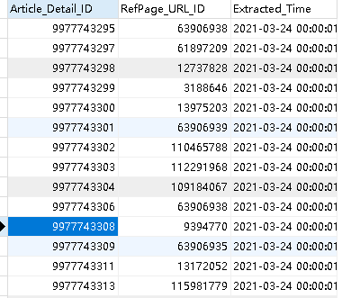
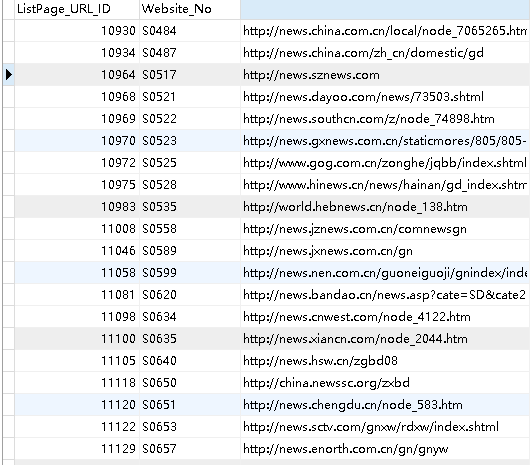
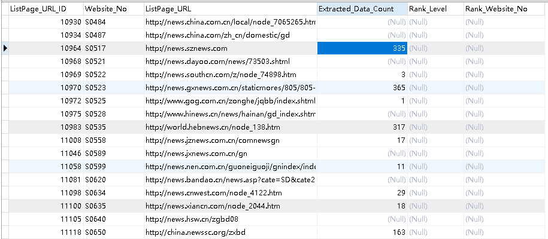
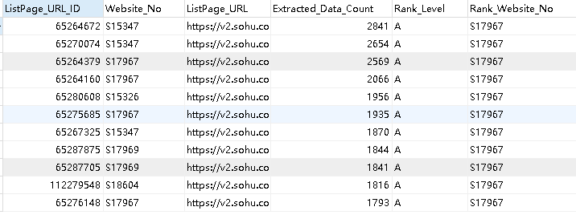
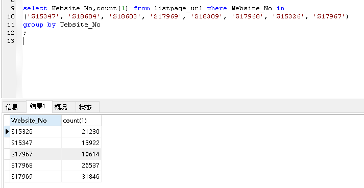

## 简介

本程序是对KWM的网站进行调度调整的功能，针对listpage_url很多的分成多个website的情况，例如 搜狐号API_列表_2，url非常大的时候，全部同样的调度会导致某些热门的url没办法很及时采集。本程序根据url所采集的数据量进行调整，把多个website_no的情况分成5个website_no，分别对应A、B、C、D、E等级，每个等级占比分别为10%、15%、20%、25%、30%。

## 流程分析

#### 1.从主数据库116导出detail到118

```
a_output_detail_to_datasource
```

导出最近7天的detail数据到118，结果表为listpage_url_by_detail。


#### 2.从主数据库116导出listpage_url到118

```
b_output_listpage_to_datasource
```


#### 3.计算每个listpage_url的数据量

```
c_update_extracted_data_count
```



#### 4.对某个网站进行等级划分

```
d_rank_listpage_url
```
需要输入要调整的网站编号列表和调整后每个等级对应的网站编号，例如：
搜狐号：
目前在KWM里面所建的网站编号
website_no_input = ('S15347', 'S18604', 'S18603', 'S17969', 'S18309', 'S17968', 'S15326', 'S17967')
调整后A、B、C、D、E五个等级的编号
website_no_output = ('S17967', 'S15347', 'S15326', 'S17968', 'S17969')



#### 5.把最终接口更新回主数据库116

```
e_reset_listpage_url_in_center
```


## 运行
打开 run.py ，编辑 need_init，website_no_input，website_no_output 三个参数，
need_init 是指是否需要初始化，即重新导detail和listpage_url到118，一般一周运行一次即可。
website_no_input 是需要调整的网站编号列表，如 搜狐号API_列表_1 有8个一样的网站
website_no_output 是调整后的5个等级的网站编号列表.